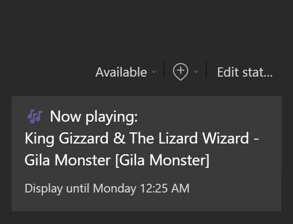

# MsTeamsLastFmStatus

Sets your Microsoft Teams status message to your currently scrobbling track on Last.fm.



## Setup

```powershell
# if not already installed, install Microsoft.Graph.Beta
Install-Module Microsoft.Graph.Beta -Scope CurrentUser
# either set LAST_FM_API_KEY in your environment variables, or:
$env:LAST_FM_API_KEY = "your_api_key_here"
.\LastFmStatus.ps1 -LastFmUser "plusreed"
```

## Dependencies

You need `Microsoft.Graph.Beta` specifically for this to work. This is due to the fact that the Microsoft Graph API for user status messages is still in beta. You also need to be able to grant applications access to your Microsoft 365 account with the `User.ReadWrite` and `Presence.ReadWrite` scopes (typically, you will be able to do this just fine.)

You also need a Last.fm API key. You can get one [here](https://www.last.fm/api/account/create).

## License

MIT